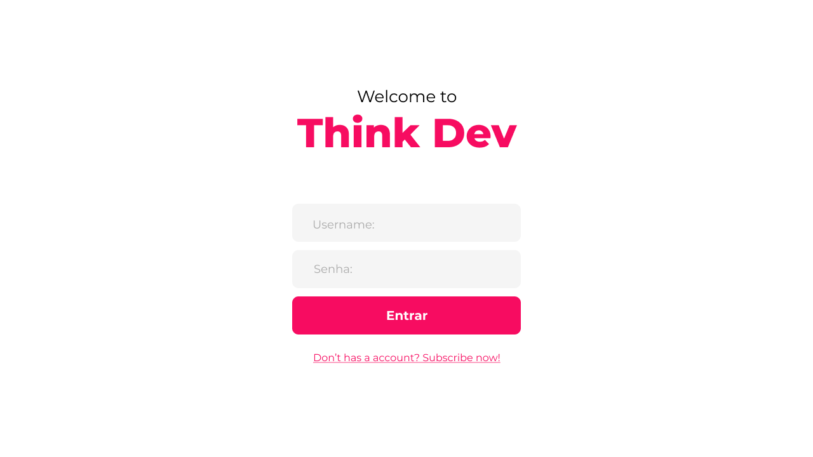
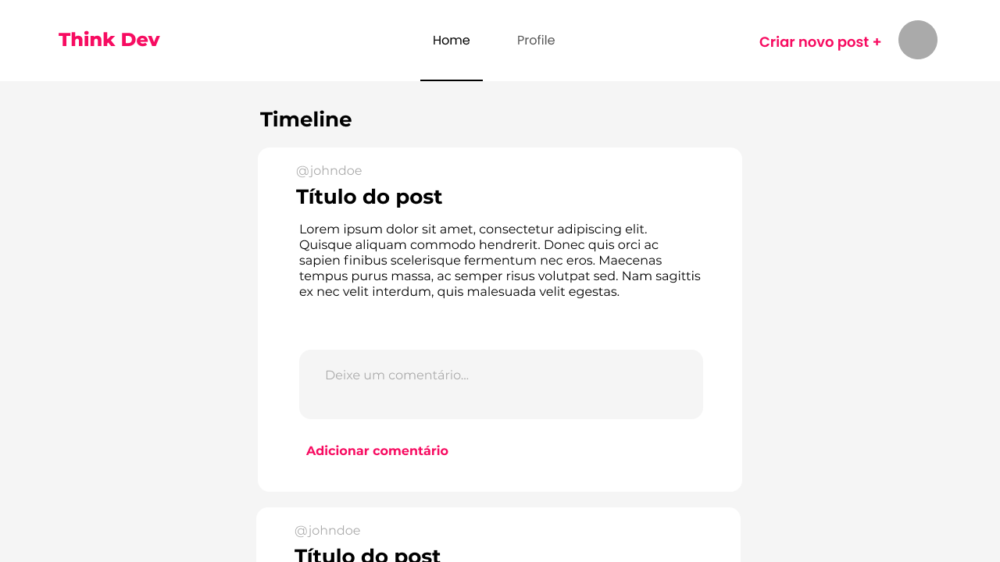
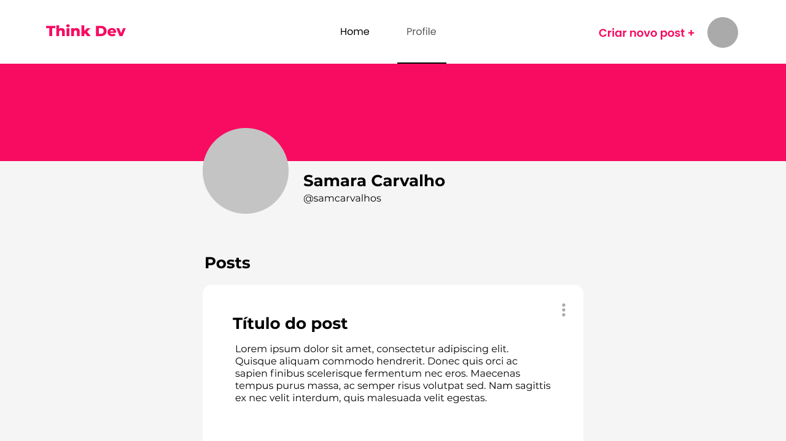

<h1 align="center">
    
</h1>

<h2 align="center"> 
	Think Dev
</h2>

## 💻 Sobre o projeto

Think Dev é um projeto desenvolvido para o teste prático da QuikDev.


## 🎨 Layout

O layout da aplicação foi prototipado com o Figma:

<p align="center" style="display: flex; align-items: flex-start; justify-content: center;">
  
  
  
</p>

## 🛠 Tecnologias

As seguintes ferramentas foram usadas na construção do projeto:

- [React][reactjs]
- [Vite.js][vitejs]
- [TypeScript][typescript]
- [MaterialUI][materialui]
- [ReactHookForm][reacthookform]
- [Yup][yup]
- [ReactTostify][reacttostify]
- [ReactRouterDom][reactrouterdom]
- [Figma][figma]


## 🚀 Como executar o projeto

### Pré-requisitos

Antes de começar, você vai precisar ter instalado em sua máquina as seguintes ferramentas:
[Git](https://git-scm.com), [Node.js][nodejs]. 
Além disto é bom ter um editor para trabalhar com o código como [VSCode][vscode]

### 🎲 Rodando a aplicação

```bash
# Clone este repositório
$ git clone https://github.com/scarvalhos/thinkdev

# Acesse a pasta do projeto no terminal/cmd
$ cd thinkdev

# Instale as dependências
$ npm install

# ou

$ yarn

# Execute a aplicação em modo de desenvolvimento
$ npm run dev

# ou

$ yarn dev

# A aplicação inciará na porta:3000 - acesse http://localhost:3000
```


Feito com ❤️ Samara Carvalho 👋🏽 [Entre em contato!](https://www.linkedin.com/in/scarvalhos/)

[nodejs]: https://nodejs.org/
[typescript]: https://www.typescriptlang.org/
[reactjs]: https://reactjs.org
[vitejs]: https://vitejs.dev/
[materialui]: https://mui.com
[reacthookform]: https://react-hook-form.com/
[yup]: https://www.npmjs.com/package/yup
[reacttostify]: https://www.npmjs.com/package/react-toastify
[reactrouterdom]: https://reactrouter.com/
[figma]: https://figma.com

[yarn]: https://yarnpkg.com/
[vscode]: https://code.visualstudio.com/

[vceditconfig]: https://marketplace.visualstudio.com/items?itemName=EditorConfig.EditorConfig
[vceslint]: https://marketplace.visualstudio.com/items?itemName=dbaeumer.vscode-eslint
[prettier]: https://marketplace.visualstudio.com/items?itemName=esbenp.prettier-vscode
[rs]: https://rocketseat.com.br
